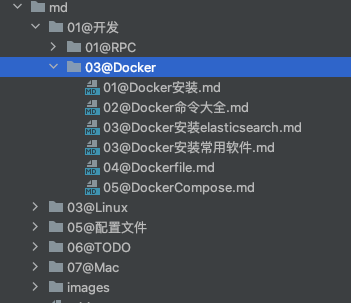

markdown-note是一款轻量的笔记程序，用于快速构建轻量笔记网站。前端框架采用[光年后台管理模板](http://lyear.itshubao.com/)搭建

#### 支持平台

> Windows、Linux 、Mac Os 

#### 效果展示

- markdown文档列表



- 显示效果


#### 安装

1. 拉取代码

> git clone https://github.com/work2php/markdown-note.git

2. 拉取依赖

> go mod download

3. 创建配置文件

>  cd config   
>  cp config.yml.example config.yml

4. 创建markdown文件目录

> cd markdown-blog-linux-amd64  
> mkdir md   
> echo "### Hello World" > ./md/主页.md

5. 按照示例修改配置文件

6. 启动程序

> go run main.go   

7. 访问 http://localhost:9090 ,查看效果

#### markdown 文档目录位置

程序不限制文档存放在服务器位置，只要赋予读权限即可

#### 导航排序

> 程序默认按照 `字典` 排序，可以通过 数字加@（`01@`）来自定义排序

#### 插入图片    

在Markdown文档中，如果需要插入图片，只需在markdown目录下创建images文件夹，并使用相对路径引入即可

#### NGINX代理配置文件


```
# http 配置
server {
    listen      80;
    listen [::]:80;
    server_name yourhost.com;

    location / {
         proxy_pass  http://127.0.0.1:5006;
         proxy_set_header   Host             $host;
         proxy_set_header   X-Real-IP        $remote_addr;
         proxy_set_header   X-Forwarded-For  $proxy_add_x_forwarded_for;
     }
}

# https 配置
server {
    listen          443 ssl;
    listen          80;
    server_name     yourhost.com;
    access_log      /var/log/nginx/markdown-note.access.log main;


    #证书文件名称
    ssl_certificate /etc/nginx/certs/yourhost.com_bundle.crt;
    #私钥文件名称
    ssl_certificate_key /etc/nginx/certs/yourhost.com.key;
    ssl_session_timeout 5m;
    ssl_protocols TLSv1.2 TLSv1.3;
    ssl_ciphers ECDHE-RSA-AES128-GCM-SHA256:HIGH:!aNULL:!MD5:!RC4:!DHE;
    ssl_prefer_server_ciphers on;

    location / {
         proxy_pass  http://127.0.0.1:5006;
         proxy_set_header   Host             $host;
         proxy_set_header   X-Real-IP        $remote_addr;
         proxy_set_header   X-Forwarded-For  $proxy_add_x_forwarded_for;
     }
 }
```


#### TODO

- 记录日志
- markdown文档支持公式及流程图
- 主题切换
- markdown文档自动更新